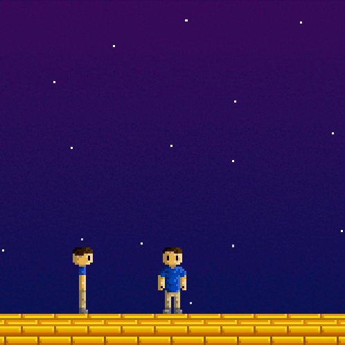
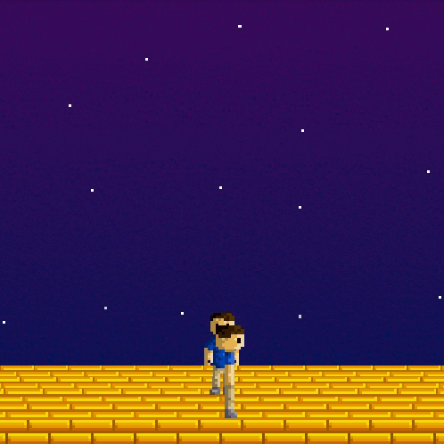

# Pseudo3D

## About
Pseudo3D is a simple game library written using JavaFX. This library uses sprite scaling and drawing order to achieve a fake perspective effect for a 3D axis-aligned bounding-box physics scene.

## Purpose
Pseudo3D started off as an insignificant 2D game I was working on as my first project away from my Minecraft projects. Later on, that started to turn into a 2D game library. I was not satisfied with two dimensions, so I decided to add a third axis to the library, sparking the beginning of what would become Pseudo3D. I plan to use this library to make some simple games of my own in the future.

## Usage
***Wiki coming soon!***

For now, view the [Example class](src/test/java/Example.java) for a basic idea of how to create a simple scene.

There are also [JavaDocs](https://jeremynoesen.github.io/Pseudo3D/javadoc) available.

## Building
This project is not complete yet, but if you wish to build it to use it, you can clone or download this repo. Then, in the folder of the project, you can open terminal and run `./gradlew build`. This should make a jar out of Pseudo3D. With this, you can add the jar as a dependency to your project.

## Demonstration
The following are recordings of the Pseudo3D renderer and physics in action. You can also try these out for yourself by running the [Example class](src/test/java/Example.java).

### Orthographic
This is what an orthographic, or zero-degree field-of-view, render looks like. This is the style used for 2D sprite-based games. There is no depth whatsoever, making it difficult to decipher the exact positioning of the character with respect to the other character or the ground. In this, the character can only move in 2D space. Sprites are only drawn in 2D.

### Perspective
This is what the Pseudo3D rendering looks like. Sprites scale based on distance from the camera, camera field of view, camera sensor size, and zoom; however, they are still rendered as 2D sprites. You can make out the position of the moving character in relation to the stationary character in what feels like 3D space.

## Contributing
This is a solo project of mine at the moment, so I am not looking to allow any other contributors. You are welcome to create an issue if something is not working right.

## Notice
This project is incomplete. You can view the project boards to see what is planned for the future. A wiki will eventually be made with documentation and examples, but until then, there are no direct explanations available. Not everything is implemented yet, so use at your own risk.
